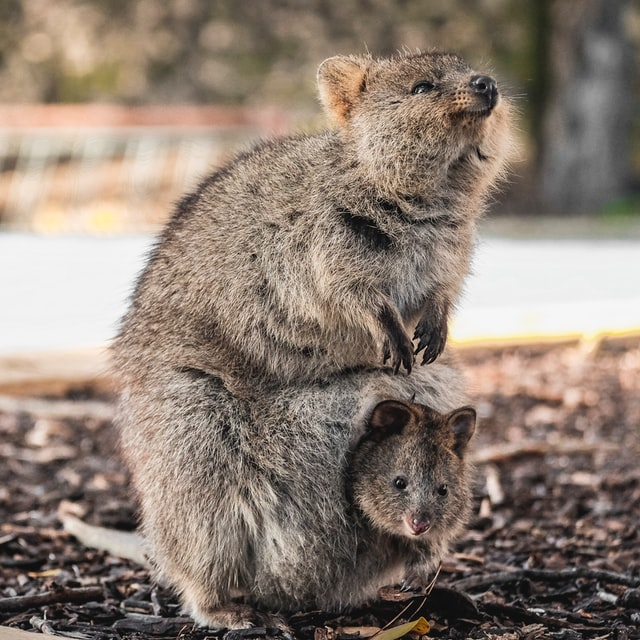

## A little about the cute Quokka (our project name and logo)

Photo by <a href="https://unsplash.com/@cmnmendoza?utm_source=unsplash&amp;utm_medium=referral&amp;utm_content=creditCopyText">Christine Mendoza</a> on <a href="/s/photos/quokka?utm_source=unsplash&amp;utm_medium=referral&amp;utm_content=creditCopyText">Unsplash</a>

Quokka is a cute marsupial about a size of a domestic cat. Like other marsupials, the quokka is herbivorous and mainly nocturnal.

Quokkas ar found on some smaller islands off the coast of Westerna Australia, particularly Rottnest Island. A small colony exists at the eastern limit of their range in a protected area of Two Peoples Bay Nature Reserve, where they co-exist with the critically endangered Gilbert's potoroo.

Quokkas have a reputation of being the happiest animal on Earth and they have little fear of humans and commonly approach people closely, particularly on Rottnest Island, where a prevalent population exists.

Enjoy some videos showing quokkas interacting with humans:

- [Quokkas: The Happiest Animals on the Internet](https://youtu.be/nj-EGNN5HwQ)
- [How Quokka Selfies Helped Protect This Adorable Animal](https://youtu.be/-E7K5D_OGvU)
- [Quokka Selfie Tutorial - How to take Animal Selfies - Ultimate Guide](https://youtu.be/kkdXHbjshNY)